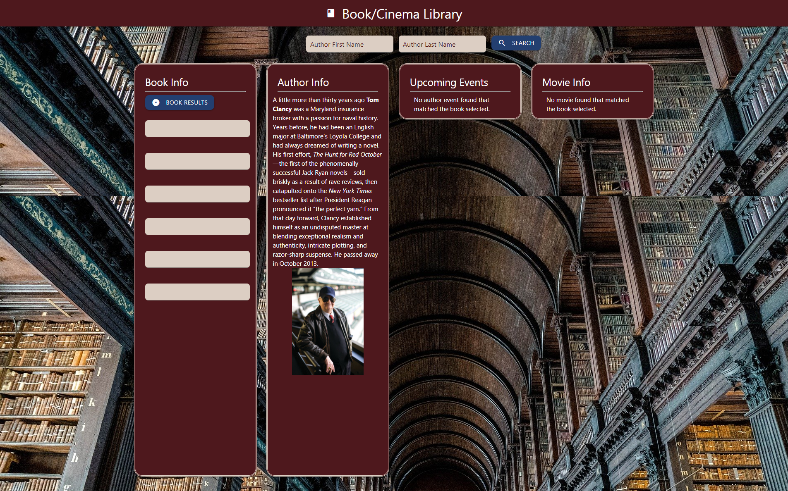
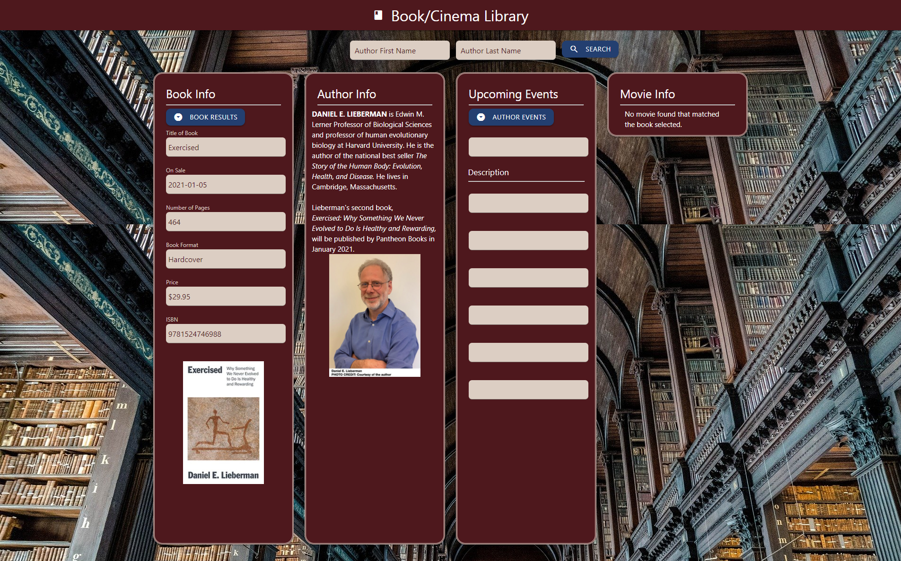
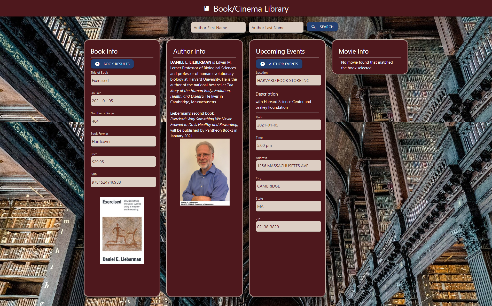
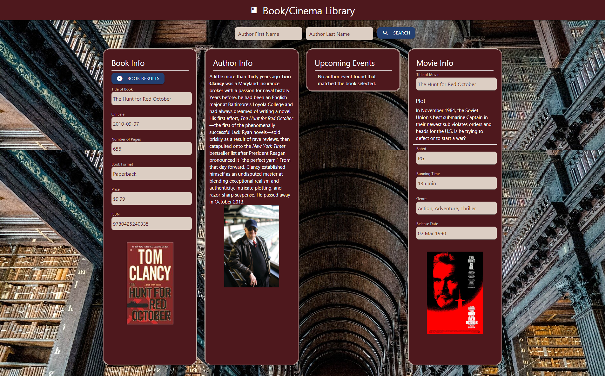

# Book/Cinema Library

### Group Name: The Librarians
#### By John Toth, Duc Dinh, Walter Leiva, Matias Monaco

## Description

This group project allows a user to search by an author's name and retrieve book titles written by that author.   An author biography and photo, if available, is retrieved for displaying.   Once a user selects a particular book title, the application then proceeds to display information about the selected book such as release date, number of pages, ISBN, format of media, and pricing.   The application proceeds to display to the user some additional information once a book title is selected.   Based upon the selected book, the application will display any upcoming author events.   The user picks from the list of events and further information about the event is displayed such as the location, date, time, and address.   Secondly, the book title is also used to search if there were any movies based upon that book title.  If a movie is found, the application then displays the plot, the rating, the runtime and genre of the movie.   Lastly, if there was a movie poster available that is displayed as well.

This project utilized HTML, CSS, javascript, jquery and 3rd party API calls to make this application.   There were 3 distinct API calls utilized.   One was the dayjs to go retrieve current day.   This was needed to limit the author event search results to current day and future events.  The second API was the Random House publishing API to retrieve author information, author events, book titles and book information.   In order to piece together all the appropriate book/author information, there were 6 different calls made to the Random House API.  The third API was a call to the Open Movie Database API.  This API was utilized to retrieve any movie information based upon the book title the user picks and also to retrieve the associated movie poster image.  Lastly, the OpenLibrary API was utilized to retrieve the book cover art image based upon the ISBN.

Local storage was used to keep track of the last search author name, the ISBN of the book title selected by user, the author ID and event ID.    These pieces of information were required in order to make all the appropriate API calls to retrieve the information for the application panels upon a browser refresh or launching the application anew.  Each time one of these pieces of information was updated the information was saved out to local storage.

The application was laid out in HTML utilizing card panels for each of the sections: Book Info panel, Author Info panel, Upcoming Events panel and Movie panel.  The information for each of those sections was dynamically added via jQuery after making respective API calls.  The Book/Cinema Library is also mobile responsive where for large screens the 4 panels are displayed in one row.   As the screen size shrinks to a medium size the panels are arranged in a 2x2 configuration.    Lastly, for small screens the panels are stacked in one column.

Due to the inconsistency in retrieved data from the Random House API calls, error checking was needed to handle JSON responses that contained "null".   In these instances, the application displays "N/A" for those fields where no specific data was returned in the JSON response.  Additionally, it was discovered through use of the API that the pricing data is not always reflecting Canadian and USA pricing.   Therefore, the location of US pricing changed in the JSON response and needed to be handled.  

## Screenshots
 
The following is a screenshot of the Book/Cinema Library application upon first instance of opening it on a new device where nothing exists in local storage yet.  Due to no searched author name yet, the Book/Author/Upcoming Events/Movie Info areas reflect text that information is available until a search is performed.

  

The following is a screenshot of the Book/Cinema Library application following a user searched on author name.  At this point, author biography and author photo are displayed if available.    The Book Info panel now has a button to trigger a dropdown of book titles that user can now choose from.

  

The following is a screenshot of the Book/Cinema Library application following a user book selection.  In this instance, the user selected book contained no movie information, but there were upcoming author events.   The Upcoming Events panel now has a button to trigger a dropdown of author events that user can now choose from.

  

The following is a screenshot of the Book/Cinema Library application following a upcoming event selection.  In this instance, the user selected specific author event from dropdown list.   The information about the event is now displayed in corresponding fields in the Upcoming Events panel.

  

The following is a screenshot of the Book/Cinema Library application following a different user book selection.  In this instance, the user selected book contained no upcoming author events, but related movie information.   The Movie Info panel displays the movie information and associated movie poster if available.

  

## Setup/Installation Requirements

Direct link to repository:  https://github.com/jtoth7824/group_project1

Direct link to Book/Cinema Library webpage:  https://jtoth7824.github.io/group_project1/

## Support and contact details

Please email any of the team members for further information

<h5>John Toth</h5>jtoth7824@gmail.com

<h5>Duc Dinh</h5>jackmol3@gmail.com

<h5>Walter Leiva</h5>leivawalt@gmail.com

<h5>Matias Monaco</h5>matiasmonaco10@gmail.com

## Technologies Used

Third Party APIs

jQuery

Javascript

Local Storage

# APIs utilized

Random House publishing, OMBDB api, openlibrary API, dayjs

# Project Description:

Book site where user can search by author name or book title and retrieve information about author or the book. This could include items such as sale date, author bio, book cover, page count, usa pricing info. The author is then searched upon if there is any current author event and information about the author event is displayed. The book title is searched behind the scenes for any related movies based upon that book title. The movie info is then displayed along with possible movie poster.

# Team members and responsibilities:

John:  Javascript/jquery

Walter: HTML/CSS/responsiveness

Matias: HTML/CSS/powerpoint presentation

Duc:  API research, Javascript
